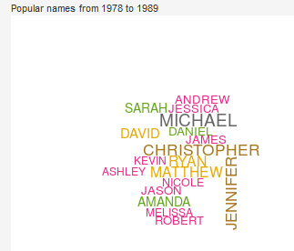

# Baby name Explorer
### An R shiny app exploring trends in baby names in BC

Check out the deployed app [here](https://goldlist.shinyapps.io/Baby_Name_Visualizer/)!

## 1. Overview

How popular is your name?  Your child's name?  How has that changed over time? What names tend to be popular at the same time? This app will help you understand naming trends over time.  

## 2. Description of the data

This app uses two data sets, both available on data.gov.bc.

* [BC popular girls names](https://catalogue.data.gov.bc.ca/dataset/most-popular-girl-names-for-the-past-100-years/resource/c9a3af38-f374-412a-9cbe-0dd590f677f9)

* [BC popular boys names](https://catalogue.data.gov.bc.ca/dataset/most-popular-boys-names-for-the-past-100-years)

These datasets (which are in the same form), contain all names that were used 5 or more times in BC over the last hundred years.

This data is available under an [Open Government License - British Columbia](https://www2.gov.bc.ca/gov/content/data/open-data/open-government-license-bc).  

### Attribution

Thanks to Duong Vu for pointing me towards word clouds as a way of visualizing name.  Thanks to Sam and Charlie (my style consultants / children) who helped design where things should be on the sketch above, and pointed out that only having an option of male or female made no sense because all kids should be treated the same.
