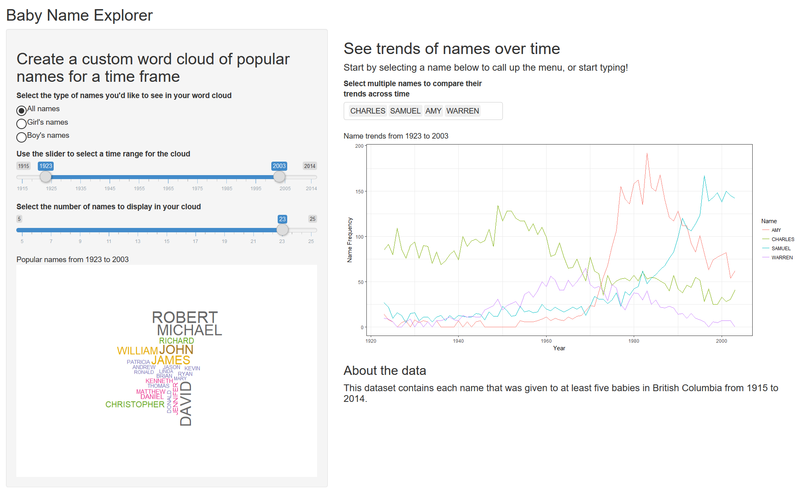
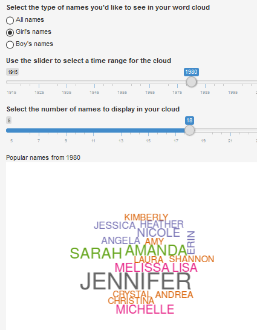
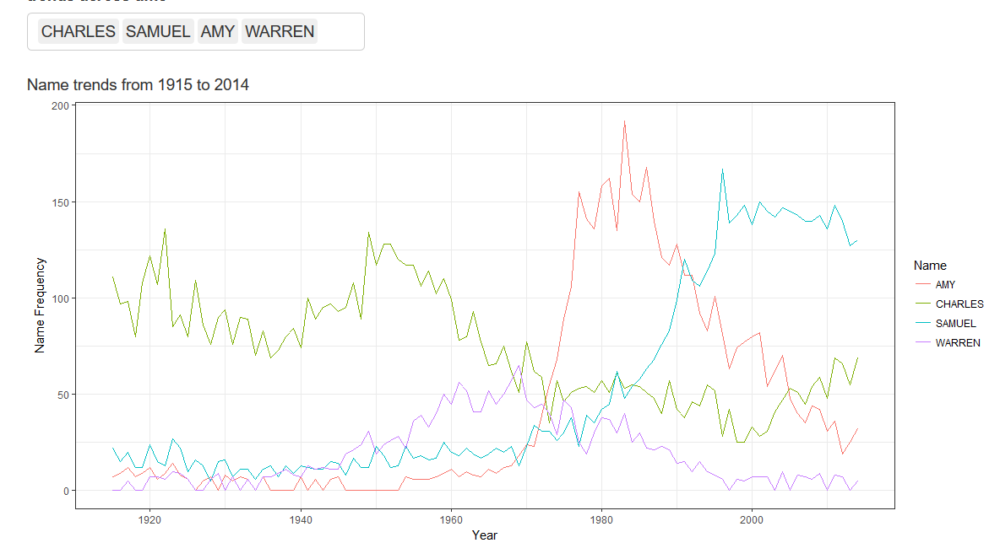
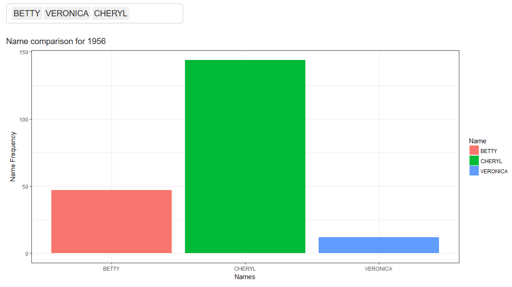

# Baby name Explorer
### An R shiny app exploring trends in baby names in BC

Check out the deployed app [here](https://goldlist.shinyapps.io/Baby_Name_Visualizer/)!

## 1. Overview

How popular is your name?  Your child's name?  How has that changed over time? What names tend to be popular at the same time? This app will help you understand naming trends over time.  

## 2. About the app

This app consists of two parts.

#### Word cloud

Select a year or range of years using the slider, and filter the names by gender, if you'd like.  You will get a custom word cloud of names popular during this time.  You can also select the number of names you'd like to see in your cloud, from 5 through 25.

#### Name trends

Again, you can select a range of years and filter by gender, to see the trends of name over time.  You can type in up to 20 names, but that many is very crowded!  

A timeseries across one year is not very exciting.  If the time slider has only one year selected, you will see a bar chart comparing the selected names.

## 3. Description of the data

This app uses two data sets, both available on data.gov.bc.

* [BC popular girls names](https://catalogue.data.gov.bc.ca/dataset/most-popular-girl-names-for-the-past-100-years/resource/c9a3af38-f374-412a-9cbe-0dd590f677f9)

* [BC popular boys names](https://catalogue.data.gov.bc.ca/dataset/most-popular-boys-names-for-the-past-100-years)

These datasets (which are in the same form), contain all names that were used five or more times in BC over the last hundred years.  These raw data files are also [here](data) in this repository, or in tidier form [here](app_files/app_data).

This data is available under an [Open Government License - British Columbia](https://www2.gov.bc.ca/gov/content/data/open-data/open-government-license-bc).  

## 4. Dependencies

This app was created in R with **shiny**, with help from the **wordcloud** package.  In order to run, you will need to have the following R packages installed:
 * shiny
 * wordcloud
 * dplyr
 * ggplot2
 * readr

 If you are interested in looking at the code, it is available [here](app_files).

### Attribution

Thanks to Duong Vu for pointing me towards word clouds as a way of visualizing name.  Thanks to Sam and Charlie (my style consultants / children) who helped design where things should be on the sketch above, and pointed out that only having an option of male or female made no sense because all kids should be treated the same.

Thanks to Tamara Munzner and all of the TAs and my classmates in DSCI 532, for the suggestions and help.
